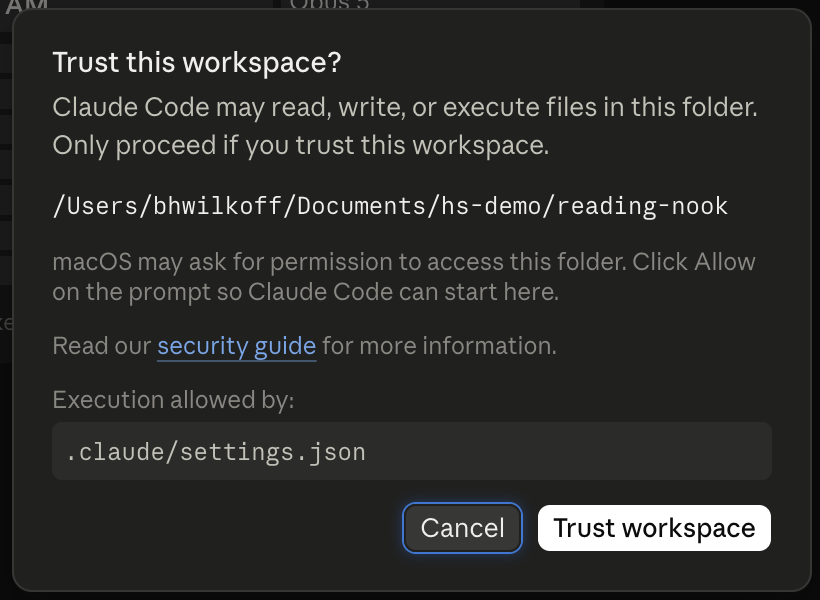
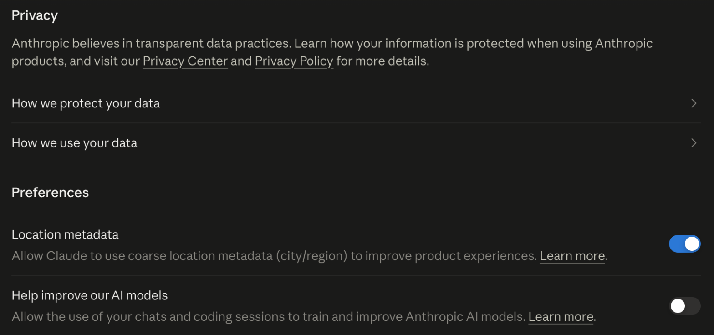
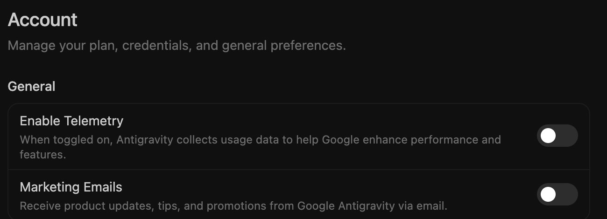
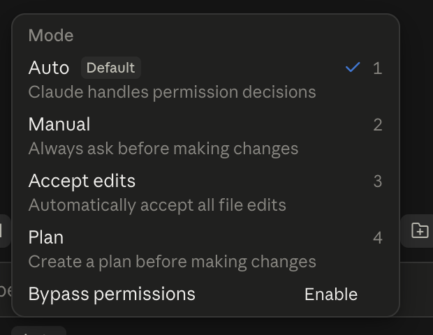
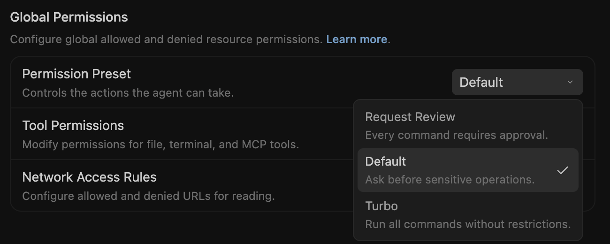
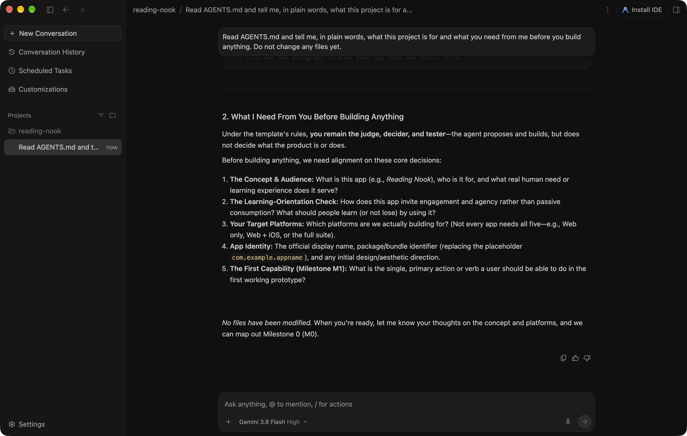

# Getting set up

<!-- The screenshots on this page, and the one-line notes under them, were placed by Claude on October 7, 2026, from docs/images/agents/, and await Ben's review. -->

**Where you are.** You have an idea for an app, or the beginning of one,
and nothing else yet: maybe not a GitHub account, and maybe not an AI
agent. This page gets you from there to your own copy of this template,
an agent that can work in it, and your app's own address open on your
phone.

When I counted every step from a fresh browser on October 1, 2026, the
shortest path from "no GitHub account" to "my app is live on my phone"
was nine steps on a Mac, and only a few of them were things a person has
to do with their own hands. The rest are things you ask your agent to do
for you, which is the first lesson of the whole path, so it might as
well be the first thing you try.

**You make the accounts. The agent does the rest.**

## What I want

I want the first hour to end with something that is yours: an address
with your app's name on it, open on the phone in your pocket. Not a
tutorial project, and not a screenshot of someone else's app. It is a
small thing, and yet it changes what the next five weeks feel like,
because from then on you are improving something that exists rather
than imagining something that does not.

## What it costs

I would rather you know this before you start than find it out halfway
through.

- **GitHub** is free, and so is putting your app on the web with GitHub
  Pages.
- **An AI agent that can work in your repository** is the one real
  cost, and you bring your own, so start with whichever you already
  have. Claude's free plan does not include Claude Code, so the cheapest
  way in is Claude Pro, at about $20 a month. I build with Claude Code,
  so that is the one these pages describe first.
- **Google's route is Antigravity, for now, and this may change.**
  Gemini CLI stopped serving free and Google AI Pro accounts on June 18,
  2026, and it now works only with a paid Gemini API key or a Gemini
  Code Assist license. Antigravity took its place, and its free plan
  comes with a weekly limit that Google does not publish in numbers and
  has changed twice this year, so check what it offers on the day you
  start. Google AI Pro, also about $20 a month, raises that limit.
  Wherever a step works differently in Antigravity, these pages have a
  note for it. The research behind this, with its sources, is
  `docs/research/gemini-and-other-agents.md`.
- **I do not recommend OpenAI's tools** for this path. Any agent that
  reads `AGENTS.md` can follow it, but Claude and Google's agents are
  the ones it is written and tested for.
- **If you will not use any AI company at all,** there is a third way,
  with a model that runs on your own computer, and it costs nothing but
  the computer. It is slower and asks more of you, and it has its own
  section below.
- **A desktop or laptop computer** is the setup I recommend, because it
  lets you build both on your own machine and in the cloud. A Mac lets
  you build for Apple's devices later; Windows and Linux reach the web,
  Android, and Windows. If all you have is a phone, the cloud way below
  still gets you to the end of this page.
- **Store accounts** ($99 a year for Apple, $25 once for Google) are not
  needed for months, and maybe never. The web and free Android sharing
  go a long way first.

## What to do

These are the only steps that need your own hands. Everything after
them is a conversation.

1. **Make a GitHub account** at github.com, verify your email, and turn
   on two-factor sign-in now, while you are there. GitHub asks for it
   eventually, and it is easier before you have anything to lose.
2. **Make your own copy of this template.** On the template's page on
   GitHub, click "Use this template," then "Create a new repository."
   Give it your app's name, and keep it public, which is what lets
   GitHub Pages put it on the web for free.
3. **Get your agent.** For Claude, subscribe to Claude Pro at claude.ai,
   then install the Claude desktop app on your computer and sign in. Its
   Code tab is Claude Code. For Gemini, download Antigravity from
   antigravity.google and sign in with your Google account. Whichever
   you use, if it asks whether you trust a folder, say yes, because
   until you do it cannot read the template's instructions.

   

   Read the folder's name before you trust it: it should be your app's folder.
4. **Decide what happens to your words before you send any.** Both
   companies can use what you type to train their next models unless you
   say no, so make that choice now, while there is nothing to take back.
   - **Claude:** the setting is at claude.ai, Settings, Privacy
     (claude.ai/settings/data-privacy-controls). Anthropic says that with
     it on, what you send is kept for five years and used for training;
     with it off, it is kept for 30 days
     ([Claude Code data usage](https://code.claude.com/docs/en/data-usage)).

     
   - **Antigravity:** turn off **Enable Telemetry** under Settings,
     Account ([Antigravity settings](https://antigravity.google/docs/settings/)).
     People on Google's own forum report that this is not the same as
     training, and that **Gemini Apps Activity**, in your Google account,
     has to be off too. I could not find Google saying so plainly, so
     turn off both.

     
5. **Start where you can see every change.** In Claude's Code tab, the
   selector beside the send button offers Auto, Manual, Accept edits,
   and Plan. Choose **Manual** for your first night, so every change
   shows up as a before and after that you accept or reject, and move to
   Auto once you know what you are looking at
   ([permission modes](https://code.claude.com/docs/en/permission-modes)).
   In Antigravity, keep the **Default** permissions, which run commands
   in a sandbox, and keep plans on **Request review**, so the agent shows
   you its plan before it builds
   ([permissions](https://antigravity.google/docs/permissions/),
   [agent settings](https://antigravity.google/docs/agent-settings/)).

   

   
6. **Point the agent at an empty folder** on your computer (a new one
   called `Apps` in your home folder is fine), and say:

   > I just made a copy of the Universal App Template on GitHub, at
   > github.com/your-name/your-app. Please install whatever you need to
   > work with GitHub, help me sign in to GitHub so you can push for me,
   > and bring my copy down into this folder. Then read AGENTS.md and
   > tell me, in a few sentences, what this template is for.

   The agent will ask you to approve a few things, and once it will
   open a browser window for you to sign in to GitHub. That sign-in is
   yours to do. The rest is the agent's.

   

   A good first answer tells you what it read, what it needs from you, and that it has not changed anything yet.
7. **Ask for your app's name and its address:**

   > Please change the web app's name everywhere it shows to [your
   > app's name], push it, turn on GitHub Pages for this repository,
   > and tell me the address when it is live.

8. **Open that address on your phone.** That is the first win: your
   app's own name, at its own address, on a device you carry with you.
   It is also how you know the agent is really working: not because it
   said so, but because you can see the name on your own screen.

<!-- Steps 4 and 5, the last two sentences of step 8, and the cloud
paragraph's Chromebook lines were written by Claude on October 7, 2026,
from docs/research/curriculum/03-claude-code-and-antigravity.md, and
await Ben's review. -->

**If you only have a phone, a Chromebook, or an iPad, or would rather
work in the cloud,** steps 3 to 7 happen at claude.ai/code instead, in a
browser or in the Claude
phone app. Connect your GitHub account there, choose your new
repository, and send the same two requests. In the cloud, the agent
works on its own branch and asks you to merge its pull request, which is
one button on GitHub. Merging is how its work reaches your app, and
learning to read a pull request before you merge it is one of the
GitHub skills the stages keep coming back to. Antigravity on a
Chromebook or a tablet is something I could not confirm, so for now the
cloud way is Claude's.

## If you will not use an AI company

*Written by Claude, awaiting Ben's review.*

Some people come to human-shaped software because they will not hand
their work to Anthropic, OpenAI, Google, or any company like them, and
I think that is a reasonable place to stand. You can still do every
stage of this path. The model runs on your own computer, nothing you
type leaves it, and it costs nothing but the computer. It is slower,
the model is smaller, and you will do more of the looking and running
yourself, which, honestly, is a lot of what the path is trying to teach
anyway. The research behind this section, with every source, is
`docs/research/curriculum/04-open-pathway.md`.

**What your computer needs.** A computer with 8 GB of memory can run a
small model for conversation and one change at a time, and 16 GB is
comfortable. A Chromebook cannot run one, so if that is what you have,
use the third choice below.

**Choose one of three, and write down why** in your app's
`DECISIONS.md`, because the choice is part of your app's story and you
can change it later.

1. **Fully open, and nothing leaves your computer.** Olmo 3, from Ai2, a
   nonprofit, publishes its model, its training data, and its training
   code ([Ai2](https://allenai.org/blog/olmo3)). You run it with Ollama
   and work with it through Aider, both open source.
   - Install Ollama from ollama.com, then in a terminal:
     `ollama pull olmo-3:7b-instruct` (a 4.5 GB download,
     [Ollama](https://ollama.com/library/olmo-3)).
   - Install Aider: `python -m pip install aider-install`, then
     `aider-install` ([Aider](https://aider.chat/docs/llms/ollama.html)).
   - In your app's folder, run `aider --model ollama_chat/olmo-3:7b-instruct`.
     This template already tells Aider to read `AGENTS-SHORT.md`, the
     short version of the instructions, and gives the model enough room
     to hold it (`.aider.conf.yml` and `.aider.model.settings.yml`).
     Without that setting, Ollama gives a model only 2,000 tokens and
     quietly drops what does not fit.
   - Apertus, from Swiss public universities, is just as open and
     better in languages other than English
     ([ETH Zurich](https://ethz.ch/en/news-and-events/eth-news/news/2025/09/press-release-apertus-a-fully-open-transparent-multilingual-language-model.html)),
     but it is not in Ollama's own library yet, so start with Olmo 3
     unless you need it.
2. **Open models from AI companies, still on your own computer.**
   Devstral Small 2 (from Mistral) and Qwen3-Coder (from Alibaba) can
   use tools the way Claude does, so they can run your commands and
   change several files. They need 32 GB of memory or more. Run one with
   Ollama and work with it through opencode, which reads this template's
   `AGENTS.md`; `opencode.json` already points it at Ollama
   ([opencode providers](https://opencode.ai/docs/providers/)).
3. **Your computer cannot run a model.** The Public AI Inference Utility
   runs Apertus and Olmo on donated public computing
   ([Public AI](https://publicai.co/stories/utility)), and Aider can
   connect to it. Your code does leave your computer this way, to public
   models rather than to a large company. Keep its key in your terminal,
   never in a file in your repository.

**Then make the same first two requests** from step 6 and step 7 above.
A small model does exactly what you ask rather than what you meant, so
ask for one thing at a time, and if it writes a command, run it yourself
and tell it what happened. When your app's name shows up at its address
on your phone, you know it works.

**What this path does not escape.** GitHub, where your app lives, is
owned by Microsoft, and the downloads come from companies even when the
model is from a public institution. Nobody has taken a whole cohort
this way yet, so if you do, you are the person who will tell the next
one what broke.

## When something goes wrong

Something will, and that is fine. Copy the exact words of the error,
paste them to your agent, and ask what happened and what it suggests.
Most setup problems are a sign-in that did not finish or a setting that
was not switched on, and the agent can usually tell which from the
message alone. If you are in a cohort, bring anything still stuck to the
setup session, or post it in your cohort's conversation, because the
person who answers it will be the next person to need the answer.

## When you are ready to move on

You have your own copy of the template on GitHub, an agent that can
read and change it, and your app's name at its own address. Nothing
about the app is real yet, which is exactly the right place to start
[stage 00](00-why-we-build.md).

Be ready to open your app's address on your phone, and to say in one
sentence what you want it to do for someone you know.
